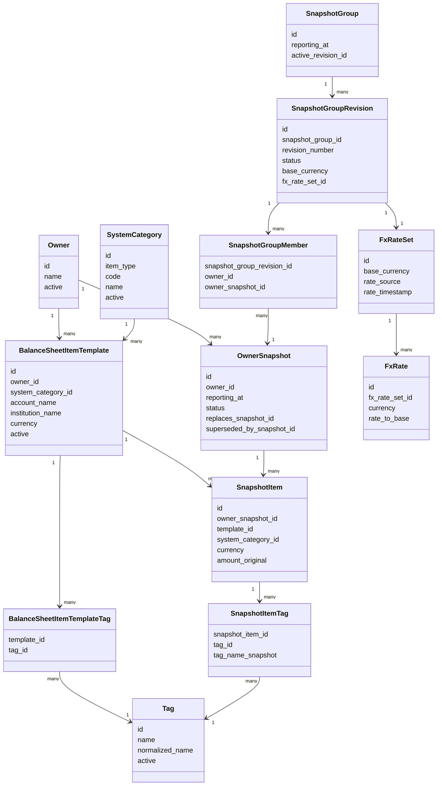

# Data Model

## Principles

Supports: `PRD-1.1`, `PRD-2.6`, `PRD-3.4`, `PRD-3.7`, `PRD-3.10`, `PRD-5.4`, `PRD-5.6`, `PRD-8.3`.

- SQLite is the V1 source of truth.
- Historical snapshot data is immutable after confirmation.
- Templates generate future snapshot rows but never rewrite existing snapshot items.
- Household group revisions are derived from selected owner snapshots; they do not own editable financial amounts.
- Official dashboard values come from finalized household group revisions and frozen FX rates.
- Display-currency conversions are estimates only when they differ from the frozen official base currency.

## Core Entities

### Owner

Supports: `PRD-1.3`, `PRD-2.4`, `PRD-3.1`.

Financial subject, not a login identity.

```text
owner
- id
- name
- display_order
- active
- created_at
- updated_at
```

Owners can be deactivated and later recovered. Historical snapshots and finalized groups retain their original owner references.

### SystemCategory

Supports: `PRD-2.1`, `PRD-3.3`, `PRD-4.1`, `PRD-7.4`.

Controlled, user-configurable dashboard category.

```text
system_category
- id
- item_type              # asset / liability
- code                   # stable lowercase slug
- name
- calculation_role       # asset_total / liability_total
- active
- display_order
- created_at
- updated_at
```

`item_type` must match any template using the category. Categories cannot be hard-deleted when referenced; deactivate them instead.

### Tag

Supports: `PRD-2.1`, `PRD-3.3`, `PRD-4.2`, `PRD-7.6`.

Managed auxiliary label for filtering and drilldown.

```text
tag
- id
- name
- normalized_name
- color
- description
- active
- created_at
- updated_at
```

`normalized_name` is unique. Tags cannot be hard-deleted when referenced.

### BalanceSheetItemTemplate

Supports: `PRD-2.1`, `PRD-2.2`, `PRD-3.2`, `PRD-3.3`, `PRD-3.4`, `PRD-3.5`, `PRD-4.4`, `PRD-6.2`.

Recurring reporting line used to generate owner snapshot items.

```text
balance_sheet_item_template
- id
- owner_id
- item_type              # asset / liability
- system_category_id
- account_name
- institution_name       # text label with autocomplete
- currency
- display_order
- active
- note
- created_at
- updated_at
```

`template_id` provides reporting-line continuity across snapshots. Renames, institution text changes, category changes, tag changes, display order changes, and active status changes affect future generated items only.

Changing template currency defaults to future snapshots only. Historical correction requires replacement owner snapshots; existing snapshot items are never mutated directly.

### BalanceSheetItemTemplateTag

Supports: `PRD-3.3`, `PRD-4.2`.

```text
balance_sheet_item_template_tag
- template_id
- tag_id
```

Unique by `(template_id, tag_id)`.

### OwnerSnapshot

Supports: `PRD-2.2`, `PRD-2.3`, `PRD-3.6`, `PRD-3.7`, `PRD-3.8`, `PRD-6.5`.

Point-in-time balance sheet for one owner.

```text
owner_snapshot
- id
- owner_id
- reporting_at
- status                 # draft / confirmed / superseded / cancelled
- source                 # manual / csv_import
- label
- replaces_snapshot_id
- superseded_by_snapshot_id
- created_at
- updated_at
- confirmed_at
- superseded_at
- revision_note
```

`reporting_at` is the canonical timestamp for the financial state represented by the snapshot. Day, month, quarter, and year are derived from it.

Confirmed snapshots are immutable. Draft snapshots may be edited or cancelled. Replacement applies only to confirmed snapshots: confirming a replacement sets the prior snapshot to `superseded` and links both records.

### SnapshotItem

Supports: `PRD-2.2`, `PRD-2.3`, `PRD-3.4`, `PRD-5.1`, `PRD-5.2`, `PRD-5.7`.

Historical copied row inside an owner snapshot.

```text
snapshot_item
- id
- owner_snapshot_id
- template_id
- item_type
- system_category_id
- system_category_code_snapshot
- system_category_name_snapshot
- account_name_snapshot
- institution_name_snapshot
- currency
- amount_original        # decimal text, nullable only in draft
- note
- display_order
- created_at
- updated_at
```

Snapshot items copy template fields at generation time. `template_id` preserves continuity; copied fields preserve historical display and calculation context.

Amounts must be non-negative. `0` means checked and confirmed as zero. Net worth is calculated as total assets minus total liabilities.

### SnapshotItemTag

Supports: `PRD-3.4`, `PRD-4.2`.

```text
snapshot_item_tag
- snapshot_item_id
- tag_id
- tag_name_snapshot
```

`tag_id` preserves tag continuity. `tag_name_snapshot` preserves historical display after tag renames.

### SnapshotGroup

Supports: `PRD-2.4`, `PRD-3.9`.

Household-level snapshot container.

```text
snapshot_group
- id
- reporting_at           # generated automatically at creation
- label
- active_revision_id
- created_at
- updated_at
```

The admin cannot manually choose `reporting_at` in V1.

### SnapshotGroupRevision

Supports: `PRD-2.5`, `PRD-2.6`, `PRD-3.10`, `PRD-3.11`, `PRD-5.3`, `PRD-5.4`, `PRD-7.1`.

Versioned finalized or draft household aggregation.

```text
snapshot_group_revision
- id
- snapshot_group_id
- revision_number
- status                 # draft / finalized / superseded / cancelled
- base_currency
- fx_rate_set_id
- created_at
- updated_at
- finalized_at
- superseded_at
- note
```

Finalizing requires exactly one confirmed owner snapshot for every owner active at finalization time. Reopening a finalized group creates a draft revision. Finalized revisions are never edited in place.

`base_currency` uses the global V1 official base currency, default CNY. V1 keeps official base currency unified; dashboard display-currency changes are estimates and do not alter revisions.

### SnapshotGroupMember

Supports: `PRD-2.4`, `PRD-3.10`, `PRD-7.5`.

```text
snapshot_group_member
- snapshot_group_revision_id
- owner_id
- owner_snapshot_id
```

Unique by `(snapshot_group_revision_id, owner_id)`. The member owner must match the selected owner snapshot owner. Selected owner snapshots must be confirmed.

### FxRateSet

Supports: `PRD-2.5`, `PRD-5.3`, `PRD-5.4`, `PRD-5.5`.

Frozen FX context for a finalized group revision.

```text
fx_rate_set
- id
- base_currency
- rate_source            # api / manual
- rate_timestamp
- created_at
- note
```

### FxRate

Supports: `PRD-5.4`, `PRD-5.5`, `PRD-5.7`.

```text
fx_rate
- id
- fx_rate_set_id
- currency
- rate_to_base           # decimal text
```

FX rates are fetched from an API when possible. Manual fallback is allowed. Finalized group revisions freeze the rate set so official historical totals do not drift.

## Precision and Display

Supports: `PRD-5.6`, `PRD-5.7`.

Amounts and FX rates must not use floating-point storage. Store decimal values as validated text with up to 8 decimal places.

Display precision is presentation configuration, not stored precision. Suggested defaults:

- CNY, USD, HKD: 2 decimals.
- JPY: 0 decimals.
- BTC and similar assets: up to 8 decimals.

## CSV Import Rules

Supports: `PRD-6.1`, `PRD-6.2`, `PRD-6.3`, `PRD-6.4`, `PRD-6.5`.

CSV import is strict and template-based.

- Export rows from active templates.
- Import must follow the exported schema.
- Unknown owners, templates, system categories, tags, currencies, malformed amounts, and negative amounts are import errors.
- Import creates draft owner snapshots only.
- CSV import never creates system categories, tags, templates, owners, or household groups.

## Soft Delete and Recovery

Supports: `PRD-3.1`, `PRD-3.5`, `PRD-8.4`.

Referenced records are not hard-deleted. Use:

- `active=false` for owners, templates, system categories, and tags.
- `status=cancelled` for abandoned drafts.
- `status=superseded` for replaced owner snapshots or group revisions.

Reactivation does not modify historical snapshots.

## Data Class Diagram


